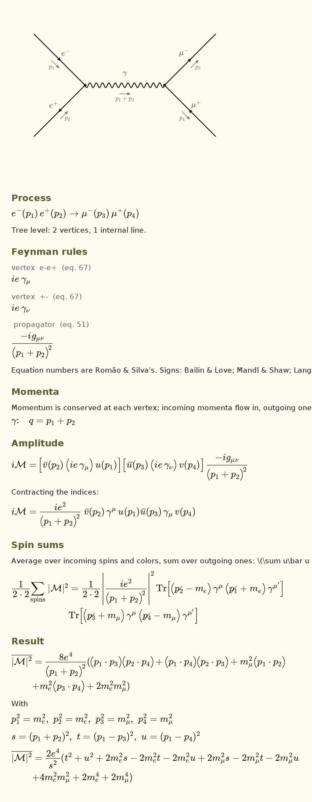

# Feynman

An Android app for drawing Feynman diagrams of the Standard Model and working out their
amplitudes: the full iℳ, the spin-summed |ℳ|² of tree diagrams, and one-loop integrals
worked through to their UV pole and finite part. It looks like its sister app,
[CAS Calculator](https://github.com/fran2402/cascalc): Material 3 Expressive, Google Sans Flex
for the interface, and Computer Modern for all the maths.

Every Feynman rule is from J. C. Romão and J. P. Silva, *A resource for signs and Feynman
diagrams of the Standard Model*, Int. J. Mod. Phys. A **27** (2012) 1230025
([doi:10.1142/S0217751X12300256](https://doi.org/10.1142/S0217751X12300256)), equations
(45)–(119), with the paper's signs η set to any book's conventions.

The project is in [`Feynman/`](Feynman); see [`Feynman/README.md`](Feynman/README.md).

